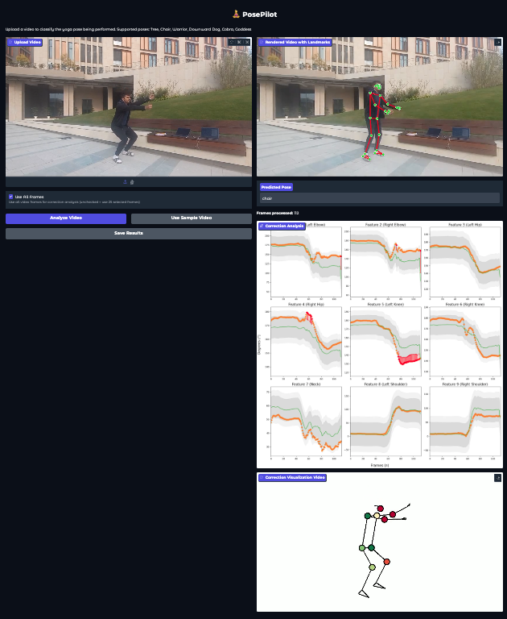

<div align="center">
	<h1>PosePilot 🧘</h1>
	<h3>If you find PosePilot helpful, give us a ⭐!</h3>
	<p>
		<a href="https://link.springer.com/chapter/10.1007/978-3-031-99568-2_17">
			
		</a>
		<a href="https://arxiv.org/abs/2505.19186">
			
		</a>
	</p>
    <h2><b>An Edge-AI Solution for Posture Correction in Physical Exercises</b></h2>
	
</div>

## Overview 📖

PosePilot is an edge-AI solution for posture correction in physical exercises, with a focus on Yoga. It integrates pose recognition and personalized corrective feedback, leveraging BiLSTM and Multihead Attention for robust, lightweight, and accurate posture analysis. The system is designed for deployment on edge devices and can be extended to various at-home and outdoor exercises.

Key features:
- Automatic human posture recognition
- Personalized, instant corrective feedback at every stage
- Lightweight and robust model for edge deployment


<div align="center">
	
</div>


## Dataset 🗂️

Our in-house dataset was created with videos from four angles, featuring 14 participants (ages 17-25) performing six poses. Frame-by-frame keypoint extraction using Mediapipe identified 33 keypoints for pose analysis. The dataset contains 336 videos, filmed indoors with controlled lighting.

For detailed information about the dataset structure, landmark mapping, and data format, see the [Dataset Documentation](data/README.md).

<div align="center">
	
</div>

## Quick Start Guide 🚀

### 1️⃣ Set Up Your Development Environment

First, clone the repository and set up your virtual environment:

```bash
git clone https://github.com/gadhvirushiraj/PosePilot.git
cd PosePilot
conda create --name posepilot-dev python=3.10
conda activate posepilot-dev
pip install -r requirements.txt
```

### 2️⃣ Train Your Own Models

Train pose classification and correction models on your data:

#### **Pose Classification Training**

```bash
python train_classify.py
```

#### **Pose Correction Training**

```bash
python train_correction.py
```

Use `--use_cached` flag to skip data preparation and use previously processed datasets for faster training iterations.

### 3️⃣ Run PosePilot

#### **Option A: Gradio Web Interface (Recommended)**

Launch the interactive web interface for pose classification:

```bash
python gradio_app.py
```

The web interface will be available at `http://localhost:7860` with the following workflow:

```
Upload Video → Extract Keypoints → Classify Pose → View Rendered Landmarks
```

**Supported poses**: Tree, Chair, Warrior, Downward Dog, Cobra, Goddess

#### **Option B: Direct Prediction**

For programmatic pose classification and correction:

* **Key Files**: `classify_predict.py` for pose classification, `correction_predict.py` for pose correction
* **First Step**: Convert video to keypoints using `give_landmarks()` function in `utils.py`
* **Then**: Use the extracted keypoints for classification or correction tasks

## Gradio GUI 

<div align="center">
	
</div>

## Citation  🏷️

If you use PosePilot in your research, please cite:

```bibtex
@InProceedings{10.1007/978-3-031-99568-2_17,
	author    = {Gadhvi, Rushiraj and Desai, Priyansh and Siddharth},
	title     = {PosePilot: An Edge-AI Solution for Posture Correction in Physical Exercises},
	booktitle = {Pattern Recognition and Image Analysis},
	year      = {2026},
	publisher = {Springer Nature Switzerland},
	pages     = {208--219},
	isbn      = {978-3-031-99568-2}
}
```
